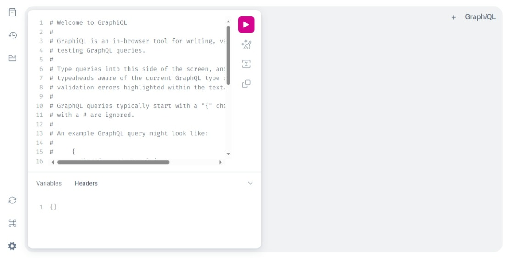
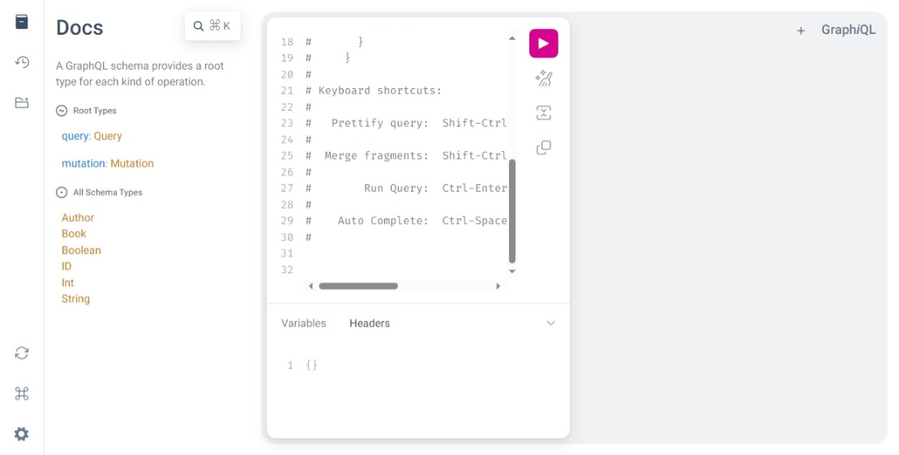
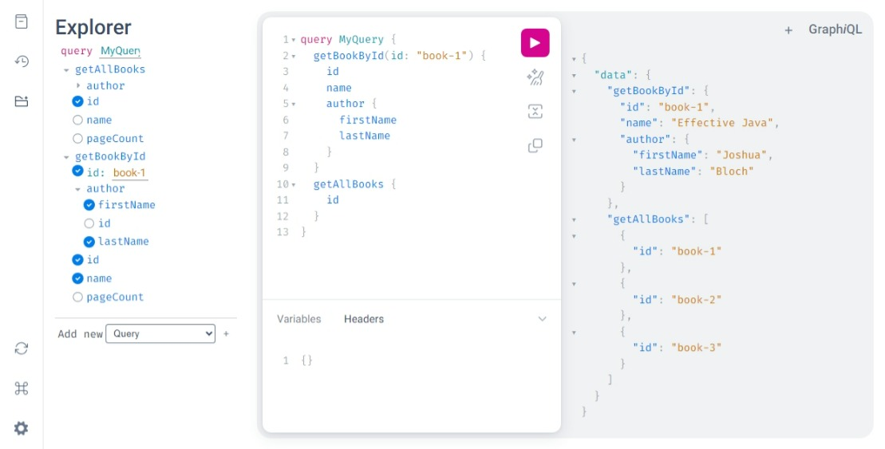

本專案是GraphQL的測試專案，使用Spring Boot與Spring for GraphQL套件架構。

關於GraphQL，可以參考以下網頁資源的介紹：

- https://tw.alphacamp.co/blog/graphql
- https://aws.amazon.com/tw/compare/the-difference-between-graphql-and-rest/

大體而言，GraphQL提供一種較為靈活的方式以增進前後端之間呼叫API的效率。最明顯的作用，是前端client可以透過GraphQL的語言格式，告訴後端它要呼叫什麼API，以及他希望後端丟什麼樣的資料回來，比如，在傳統的API中，假設我們要取得一個使用者資訊，在後端，我們通常會定義一個User Entity，如：

``` java
@Data
@Builder
@AllArgConstructor
@NoArgConstructor
public class User {
    private String id;
    private String name;
    private Integer age;
    private String city;
    private String address;
    private String mobile;
    private String phone;
    ...
}
```

我們會設計一個API，傳入一個id 字串，這樣API會回應整個User 轉為JSON結構的內容，如：

URL: POST /User/user-1

REQUEST BODY: 

``` json
{
    "id": "user-1"
}
```

RESPONSE BODY:

``` json
{
    "id": "user-1",
    "name": "Jack Yang",
    "age": 43,
    "city": "Taipei",
    "address": "addr-1",
    "mobile": "0911-222-333",
    "phone": "02-2xxx-xxxx",
    ...
}
```

亦即，除非我們有另外寫DTO或VO做轉換，否則我們通常會將整個User物件的資料都回應給前端。如果前端呼叫這個API的目的是只要這個User物件的其中幾個屬性的話，那我們將整個User物件都傳回給前端就會造成網路資源的浪費，進而拖慢系統的整體效能。對照我們使用SQL語法的情形，很明顯地看得出來這樣反倒缺少了彈性與效能。*為何我們不能只要求後端給我我要的資料就好？*

GraphQL主要目的便是處理這樣的問題。它基本上還是我們熟悉的HTTP API，但其透過更為廣泛通用的JSON資料規格格式，使得前端可以明確告訴後端它要呼叫的API，以及他想取得的資料屬性，比如前述的以ID取得使用者資料，假設前端知道呼叫`/User/1`可以取得User物件，但他只要這個物件的id, name, age三個屬性就好，那在GraphQL的架構下，REQUEST BODY會是這樣：

``` json
query UserDetails {
	getUserById(id: "user-1") {
		id
		name,
		age
	}
}
```

1. GraphQL語言界定了三種資料操作動作，分別是query, mutation, subscription
   1. query: 相當於GET，用來查詢資料
   2. mutation: 相當於POST, PUT, DELETE，用來操作資料
   3. subscription: 用來訂閱資訊（可配合websocket使用）
2. 在傳送資料尹始，需指出此資料是要query, mutation, 或是subscription?
3. 範例中的UserDetails可以任意取名，就當作是這個動作的任務名稱吧！
4. `getUserById`是後端有宣告的API名稱，不能打錯。
5. 小括弧內是要傳入的引數。
6. 大括弧內就是要求後端要傳回的資料結構，他可以是資料欄位的集合，也可以是更複雜的物件資料型態，後續範例會再描述。 

後端回應的資料會是長這樣：

``` json
{
	"data": {
		"getUserById": {
			"id": "user-1",
			"name": "Jack Yang",
			"age": 43
		}
	}
}
```

可以看到後端只會回應前端client要的資料欄位而已。

以上為GraphQL的粗淺介紹，接下來以Spring boot與Spring for GraphQL套件來建立一個可執行的範例，並以其做其他的介紹。

#### Spring Boot的設定

要使用Spring for GraphQL，可引入以下Dependency:

``` xml
<dependency>
    <groupId>org.springframework.boot</groupId>
    <artifactId>spring-boot-starter-graphql</artifactId>
</dependency>
```

通常還會引入`webflux`，主要用於subcription相關的API

``` xml
<dependency>
    <groupId>org.springframework</groupId>
    <artifactId>spring-webflux</artifactId>
    <scope>test</scope>
</dependency>
```

在`src/main/resources`下，要新增資料夾`graphql`，裡面放置`.graphqls`檔案，這裡是將其命名為`schema.graphqls`。這個檔案是描述graphql對外的API規格用，是GraphQL的核心。

在本專案中，目前有兩個查詢書籍資料的API，以及一個新增書籍資料的API。所以schema.graphqls的內容如下：

``` json
type Query {
  # Get book by id
  getBookById(id: ID): Book

  # Get all books
  getAllBooks: [Book]
}

type Mutation {
  # Add book
  addBook(name: String,
          pageCount: Int,
          authorId: String): Book
}

type Book {
  id: ID
  name: String
  pageCount: Int
  author: Author
}

type Author {
  id: ID
  firstName: String
  lastName: String
}
```

1. Query與Mutation是graphQL規定的type（還有Subscription），如有相關API要對外發佈使用的話，就要在對應的type 區塊中宣告

2. 如果有資料物件的話，也可以自訂新的type，如Book與Author，type中可再引用type，如Book中又引用Author。

   ``` json
   type Book {
     id: ID
     name: String
     pageCount: Int
     author: Author
   }
   ```

3. 有兩種註釋方式: 

   - `#`: 單行註釋
   - `"""`: 兩個``"""`包夾的區塊為多行註釋

4. API的宣告方式分為有引數與沒有引數的，寫法近似Typescript語法。

   - 有引數： method(param: value, param: value): {property_name: type, property_name: type}
   - 無引數：method {property_name: type, property_name: type}
   - 傳回陣列：method(param: value): [type] （`中括弧`）

#### Graphiql介紹

Spring boot有提供一個好用的preview工具`Graphiql`，只要在application.yml裡設定啟用，即可用http://localhost:8080/graphiql 啟動

``` yaml
spring:
  graphql:
    graphiql:
      enabled: true
```

啟動Spring boot程式後，呼叫http://localhost:8080/graphiql 會進入如下頁面：



點選可以看到所有GraphQL API列表，點選可以看到其相關規格，如在`schema.graphqls`中有寫註釋的話，也會顯示在API規格說明中。



點選可以以GUI的方式選擇要測試哪支API，以及輸入引數與設定要回傳回來的屬性。



由上圖可知，可以一次呼叫多個API，GraphQL允許同時回傳多個API的結果。

#### 程式碼介紹

本專案中，在取得資料的部分遵循標準的controller - service - repository的結構，而會與GraphQL界接的地方，除了前述的`schema.graphqls`檔案以外，主要就在controller層的程式，請參考`BookController.java`

``` java
@RestController
public class BookController {

  @Autowired
  private BookService bookService;

  @Autowired
  private AuthorService authorService;

  @QueryMapping("getAllBooks")
  public List<Book> getAllBooks() {
    return bookService.getAllBooks();
  }
  
  @QueryMapping("getBookById")
  public Book bookById(@Argument String id) {
    return bookService.getBookById(id);
  }

  @MutationMapping("addBook")
  public Book addBook(
      @Argument String name,
      @Argument Integer pageCount,
      @Argument String authorId) {
    return bookService.addBook(name, pageCount, authorId);
  }

  @SchemaMapping
  public Author author(Book book) {
    return authorService.getAuthorById(book.getAuthorId());
  }
}
```

1. 與`Spring Web`套件類似，如要宣告特定type的API，可使用`@QueryMapping`、`@MutationMapping`、`@SubscriptionMapping`等Annotations。
2. 引數要用`@Argument`宣告
3. 因為Book裡有引用Author，所以會有一個`@SchemaMapping`告訴GraphQL要如何透過Book的資訊取得Author的資訊

以上是最基本的GraphQL用法。

如果希望回傳的Book資料中有Author的相關資訊的話，可以如此下GraphQL語法

``` json
query MyQuery {
    getBookById(id: "book-1") {
        id
        name
        author {
          firstName
          lastName
        }
    }
}
```

